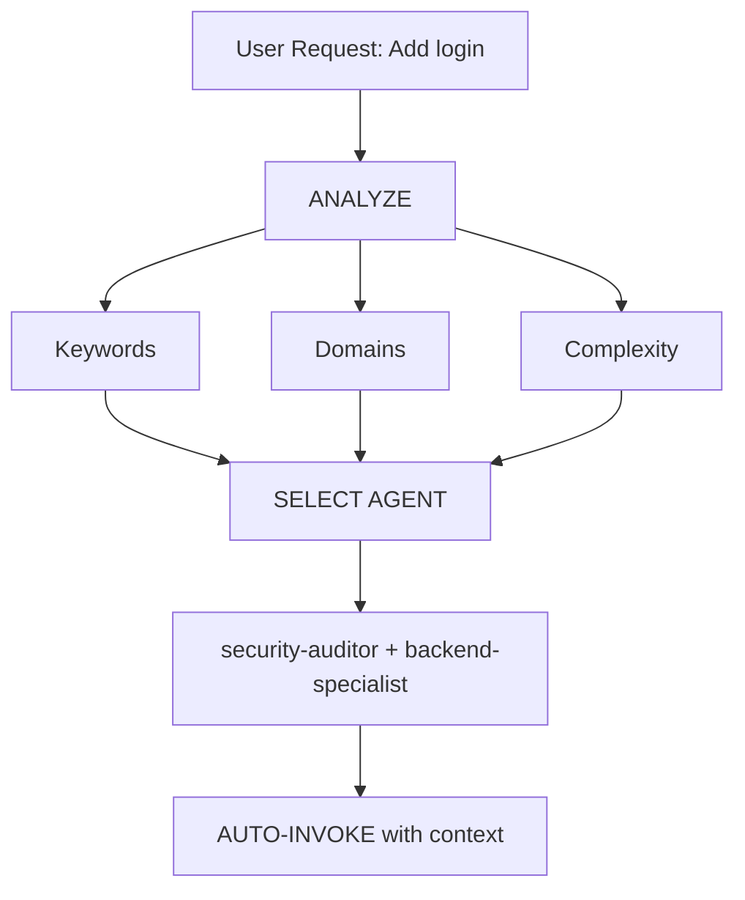

# Intelligent Agent Routing

**Purpose**: Automatically analyze user requests and route them to the most appropriate specialist agent(s) without requiring explicit user mentions.

## When to Use
- Analyzing user requests to determine appropriate specialist agent
- Automatically selecting backend, frontend, mobile, or other specialists
- Routing tasks to security-auditor, database-architect, or other agents
- Handling multi-domain requests requiring multiple specialists
- Providing transparent agent selection to users

## Core Principle

> **The AI should act as an intelligent Project Manager**, analyzing each request and automatically selecting the best specialist(s) for the job.

## How It Works

### 1. Request Analysis

Before responding to ANY user request, perform automatic analysis:



### 2. Agent Selection Matrix

**Use this matrix to automatically select agents:**

| User Intent         | Keywords                                   | Selected Agent(s)                           | Auto-invoke? |
| ------------------- | ------------------------------------------ | ------------------------------------------- | ------------ |
| **Authentication**  | "login", "auth", "signup", "password"      | `security-auditor` + `backend-specialist`   | YES |
| **UI Component**    | "button", "card", "layout", "style"        | `frontend-specialist`                       | YES |
| **Mobile UI**       | "screen", "navigation", "touch", "gesture" | `mobile-developer`                          | YES |
| **API Endpoint**    | "endpoint", "route", "API", "POST", "GET"  | `backend-specialist`                        | YES |
| **Database**        | "schema", "migration", "query", "table"    | `database-architect` + `backend-specialist` | YES |
| **Bug Fix**         | "error", "bug", "not working", "broken"    | `debugger`                                  | YES |
| **Test**            | "test", "coverage", "unit", "e2e"          | `test-engineer`                             | YES |
| **Deployment**      | "deploy", "production", "CI/CD", "docker"  | `devops-engineer`                           | YES |
| **Security Review** | "security", "vulnerability", "exploit"     | `security-auditor` + `penetration-tester`   | YES |
| **Performance**     | "slow", "optimize", "performance", "speed" | `performance-optimizer`                     | YES |
| **Product Def**     | "requirements", "user story", "backlog", "MVP" | `product-owner`                             | YES |

## 3. Response Format

**When auto-selecting an agent, inform the user concisely:**

```markdown
**Applying knowledge of `@security-auditor` + `@backend-specialist`...**

[Proceed with specialized response]
```

## Domain Detection Rules

| Domain          | Patterns                                   | Agent                   |
| --------------- | ------------------------------------------ | ----------------------- |
| **Security**    | auth, login, jwt, password, hash, token    | `security-auditor`      |
| **Frontend**    | component, react, vue, css, html, tailwind | `frontend-specialist`   |
| **Backend**     | api, server, express, fastapi, node        | `backend-specialist`    |
| **Mobile**      | react native, flutter, ios, android, expo  | `mobile-developer`      |
| **Database**    | prisma, sql, mongodb, schema, migration    | `database-architect`    |
| **Testing**     | test, jest, vitest, playwright, cypress    | `test-engineer`         |
| **DevOps**      | docker, kubernetes, ci/cd, pm2, nginx      | `devops-engineer`       |
| **Debug**       | error, bug, crash, not working, issue      | `debugger`              |
| **Performance** | slow, lag, optimize, cache, performance    | `performance-optimizer` |
| **SEO**         | seo, meta, analytics, sitemap, robots      | `seo-specialist`        |
| **Game**        | unity, godot, phaser, game, multiplayer    | `game-developer`        |


## Implementation Rules

### Rule 1: Silent Analysis

#### DO NOT announce "I'm analyzing your request..."

- ✅ Analyze silently
- ✅ Inform which agent is being applied
- ❌ Avoid verbose meta-commentary

### Rule 2: Inform Agent Selection

**DO inform which expertise is being applied:**

```markdown
🤖 **Applying knowledge of `@frontend-specialist`...**

I will create the component with the following characteristics:
[Continue with specialized response]
```

### Rule 3: Seamless Experience

**The user should not notice a difference from talking to the right specialist directly.**

### Rule 4: Override Capability

**User can still explicitly mention agents:**

```text
User: "Use @backend-specialist to review this"
→ Override auto-selection
→ Use explicitly mentioned agent
```

## Edge Cases

### Case 1: Generic Question

```text
User: "How does React work?"
→ Type: QUESTION
→ No agent needed
→ Respond directly with explanation
```

### Case 2: Extremely Vague Request

```text
User: "Make it better"
→ Complexity: UNCLEAR
→ Action: Ask clarifying questions first
→ Then route to appropriate agent
```

### Case 3: Contradictory Patterns

```text
User: "Add mobile support to the web app"
→ Conflict: mobile vs web
→ Action: Ask: "Do you want responsive web or native mobile app?"
→ Then route accordingly
```

## Integration with Existing Workflows

### With Socratic Gate

- **Auto-routing does NOT bypass Socratic Gate**
- If task is unclear, still ask questions first
- Then route to appropriate agent

### With .windsurf/rules.md Rules

- **Priority**: .windsurf/rules.md rules > intelligent-routing
- If .windsurf/rules.md specifies explicit routing, follow it
- Intelligent routing is the DEFAULT when no explicit rule exists

## Testing the System

### Test Cases

#### Test 1: Simple Frontend Task

```text
User: "Create a dark mode toggle button"
Expected: Auto-invoke frontend-specialist
Verify: Response shows "Using @frontend-specialist"
```

#### Test 2: Security Task

```text
User: "Review the authentication flow for vulnerabilities"
Expected: Auto-invoke security-auditor
Verify: Security-focused analysis
```

#### Test 3: Bug Fix

```text
User: "Login is not working, getting 401 error"
Expected: Auto-invoke debugger
Verify: Systematic debugging approach
```

## Summary

**intelligent-routing skill enables:**

✅ Automatic specialist selection based on request analysis
✅ Transparent communication of which expertise is being applied
✅ Seamless integration with existing workflows
✅ Override capability for explicit agent mentions

**Result**: User gets specialist-level responses without needing to know the system architecture.

---

**Next Steps**: Integrate this skill into GEMINI.md TIER 0 rules.

---

## Edge Case Handling
- **Multiple domains**: Request spans multiple domains - route to orchestrator or multiple specialists
- **Ambiguous keywords**: Keywords could match multiple agents - analyze context and choose most relevant
- **No clear match**: Request doesn't match any specialist - ask clarifying question or use generalist
- **Expert conflict**: User mentions specific agent but auto-routing suggests different - respect user choice
- **Hybrid requests**: Request needs both frontend and backend - route to both specialists sequentially

## Failure Modes
- **Wrong routing**: Sending task to inappropriate specialist - validate domain detection
- **Over-routing**: Routing simple tasks to specialists when generalist suffices - check complexity
- **Under-routing**: Not using specialists for complex domain-specific tasks - validate threshold
- **Silent routing**: Not informing user which agent is being used - always announce selection
- **Context loss**: Not passing context to routed agent - include full request context

## Performance Considerations
- Routing latency: Complete analysis and routing within 2-3 seconds
- Agent warm-up: Cache agent selection patterns for faster routing
- Parallel routing: For multi-domain requests, invoke specialists in parallel when possible
- Fallback speed: If specialist unavailable, quickly fallback to generalist

## Security Notes
- **Input sanitization**: Validate request doesn't contain malicious patterns before routing
- **Access control**: Ensure user has permission to invoke specific specialists
- **Audit logging**: Log routing decisions for debugging and audit trails
- **Rate limiting**: Prevent routing abuse or excessive specialist invocations
- **Sensitive domains**: Extra validation for security-related requests

## Common Pitfalls
- Not analyzing request before routing
- Routing to wrong specialist due to keyword confusion
- Not informing user which agent is being applied
- Ignoring user's explicit agent mentions
- Not handling contradictory patterns (mobile vs web)
- Over-riding user's explicit agent choices

## Best Practices
- Analyze silently before responding
- Inform user which expertise is being applied
- Use agent selection matrix as a guide
- Respect user's explicit agent mentions
- Handle edge cases (generic questions, vague requests)
- Integrate with Socratic Gate for unclear requests
