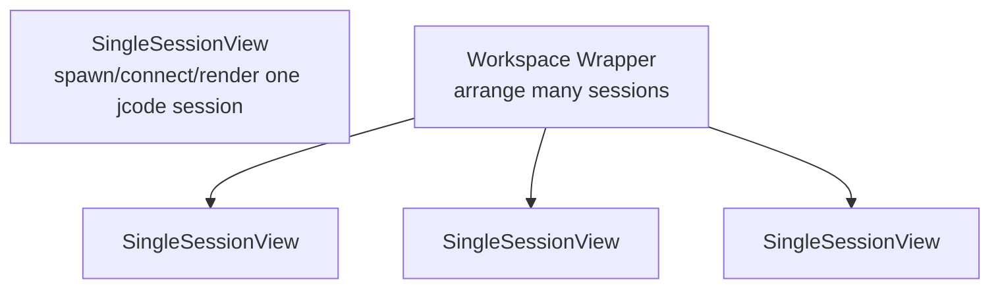

# Desktop Single Session Design

Status: active prototype
Updated: 2026-04-28

This document describes the visual target and current implementation notes for the default `jcode-desktop` single-session mode.

## Layering

The single-session view is the primitive desktop surface. The workspace mode should compose multiple single-session views rather than redefining what a session looks like.

## Current implementation snapshot

Recent desktop work has moved this from a visual target into a usable prototype:

- single-session mode starts fresh sessions on the shared jcode server
- transcript roles distinguish user, assistant, tool, metadata, status, and error lines
- assistant markdown is parsed with `pulldown-cmark`
- code, quote, table, tool, and error runs get card backgrounds
- the composer supports TUI-style editing and numbered prompts
- model picker, model cycle shortcut, and session switcher are wired
- stdin response prompts from interactive tools are displayed inline
- clipboard/workspace image attachments are supported
- transcript selection/copy is character-precise
- desktop status labels, spinner/prompt rendering, and header build version have been polished

Primary files:

- `crates/jcode-desktop/src/single_session.rs`
- `crates/jcode-desktop/src/single_session_render.rs`
- `crates/jcode-desktop/src/session_launch.rs`
- `crates/jcode-desktop/src/workspace.rs`

## Typography

Primary font target:

- Family: `JetBrainsMono Nerd Font`
- Weight: `Light`
- Fallback family: `JetBrainsMono Nerd Font Mono`, then `JetBrains Mono`, then `monospace`

Current constants in `single_session.rs`:

| Role | Size | Weight | Notes |
| --- | ---: | --- | --- |
| Session title | 28 px | Light | Top/title context and overlay titles |
| Message body | 22 px | Light | Main transcript and assistant text |
| Metadata/status | 16 px | Light | Muted status, model, cwd, token/debug hints |
| Inline code/tool output | 21 px | Light | Same family, tighter line-height |

Line-height targets:

- Body: 1.45
- Code/tool output: 1.35
- Metadata: 1.25

Rationale:

- Mono fits code, transcripts, tool output, and terminals.
- Light weight makes a dense agent session feel less heavy than the older bitmap prototype.
- Nerd Font coverage gives room for subtle icons/status glyphs without switching fonts.

## Assistant markdown presentation

Assistant markdown is converted into styled transcript lines before rendering. Current handling includes:

- headings with heading prefixes
- block quotes with quote styling
- ordered and unordered lists
- fenced code blocks with language labels
- tables as table-styled rows
- links with visible URL suffixes
- images as textual placeholders with URLs
- emphasis, strong, strikethrough, and task-list markers as readable text

The renderer then draws background cards for high-signal runs such as code blocks, quotes, tables, tool output, and errors.

## Rendering note

The older multi-panel workspace renderer still has bitmap helper paths in `render_helpers.rs`. The single-session path now has its own typography metadata, styled-line model, card rendering, and glyphon-aware caret positioning. Continue moving single-session presentation away from the old bitmap helper path as the desktop renderer matures.

## First visual goal

The default single-session window should read as one calm, focused coding conversation:

- no workspace lane/status strip in single-session mode
- one content column
- generous breathing room around the transcript
- JetBrains Mono Light Nerd for text elements where available
- muted graphite text over the soft pastel background until a more final theme is chosen
